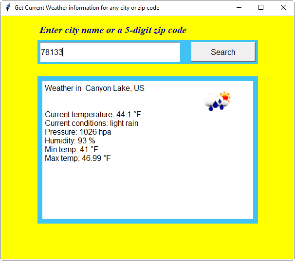
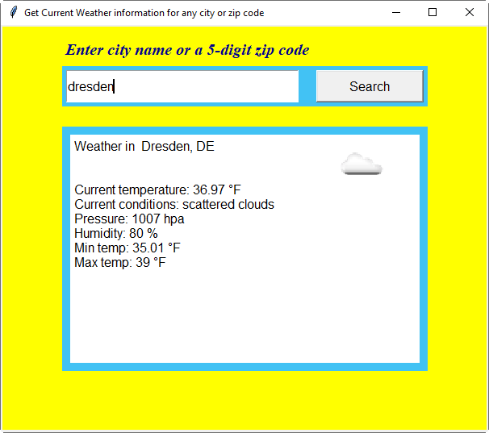
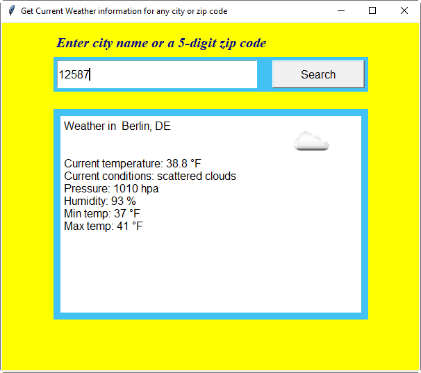

# Weather Reporter Design Document
##Requirements:
- Create a header for your program just as you have in the past.
- Create a Python Application which asks the user for their zip code or city.
- Use the zip code or city name in order to obtain weather forecast data from OpenWeatherMap.
- Display the weather forecast in a readable format to the user.
- Use comments within the application where appropriate in order to document what the program is doing.
- Use functions including a main function.
- Allow the user to run the program multiple times to allow them to look up weather conditions for multiple locations.
- Validate whether the user entered valid data. If valid data isn’t presented notify the user.
- Use the Requests library in order to request data from the webservice.
- Use Try blocks to ensure that your request was successful. If the connection was not successful display a message to the user.
- Use Python 3
- Use try blocks when establishing connections to the webservice. You must print a message to the user indicating whether or not the connection was successful
## Design
This program is designed in python programming language and developed in PyCharm development environment.
#### Design Decisions
We used the following modules for the program.

- tkinter was used for the GUI

- requests was used for the web service GET

- PIL, Image, ImageTk were used to display weather condition icons

- zipcodes was used to get information for the zip code entered. If zip code is valid, the module
returns information otherwise it sends a zero length list.

## Tests
#### Main screen

### weather information by 5-digit zip code

### weather information by invalid zip code

### weather information by city name

### weather information by city name, country name

### weather information by invalid city name

### additional tests
#### another zip code

#### another city

#### a foreign city

#### a foreign zip code

